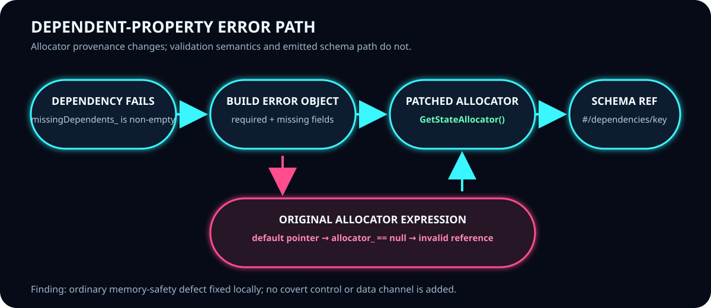
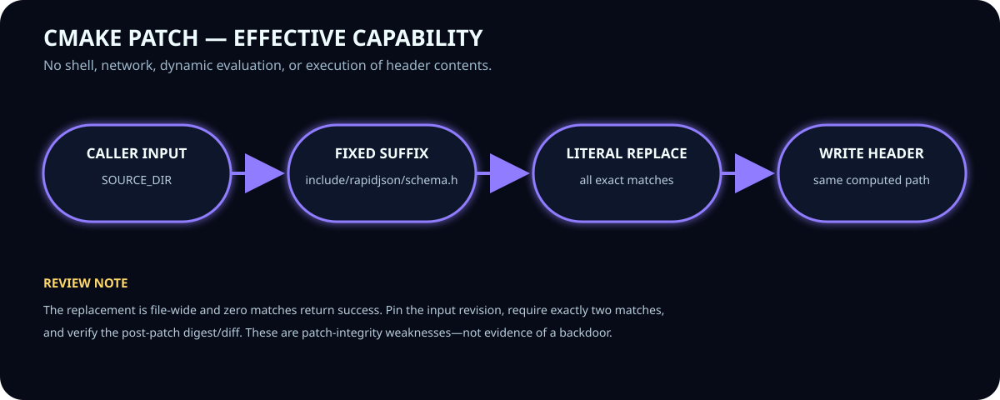

# RapidJSON allocator patch security review

**Review date:** 2026-09-15 
**Scope:** the quoted `EndMissingDependentProperties()` implementation and `fix-null-allocator-deref.cmake` only 
**Verdict:** **No backdoor indicators found in the reviewed lines.** The CMake change is a narrowly motivated memory-safety correction. It does have two patch-integrity weaknesses worth hardening, but neither is covert behavior.

> This is a bounded static and dynamic code review, not proof that the complete RapidJSON or glTF-SDK repositories, release artifacts, developer machines, or build infrastructure are compromise-free.

## Executive assessment

| Question | Assessment | Confidence |
|---|---|---|
| Does the C++ function create a covert entry point, authentication bypass, command path, or data-exfiltration path? | No such behavior is present in the reviewed function. It constructs a validation error object and JSON Pointer schema location. | High for these lines |
| Does the CMake patch inject executable source? | No. It performs one literal, file-wide expression substitution; it does not add a callback, payload, preprocessor branch, command invocation, network operation, or new dependency. | High |
| Is the stated null-reference rationale technically credible? | Yes. A default `GenericPointer` can have `allocator_ == 0`, while `GetAllocator()` returns `*allocator_`. The validator's `GetStateAllocator()` lazily creates an allocator when needed. | High for the reviewed snapshot |
| Is the script safe as a general-purpose patch mechanism? | Mostly, but not fail-closed. It replaces every exact match in the header and reports success when there are zero matches. | High |
| Can this review certify the entire supply chain? | No. Provenance, CI configuration, the complete diff, toolchain, dependencies, and produced binaries require separate verification. | High |

## What the C++ function does

When a property dependency is violated, the function:

1. Checks that at least one dependent property is missing.
2. Builds the equivalent `required` validation-error object.
3. Adds the error code and instance location.
4. Constructs a schema JSON Pointer ending in `/dependencies/<sourceName>`.
5. Stores the wrapped error under the triggering source property.

These operations affect diagnostic state. There is no socket or file I/O, process creation, dynamic loading, credential logic, environment lookup, deserialization into executable objects, or indirect call introduced by the two allocator arguments.

### Why the original expression is defective

`GenericPointer::GetAllocator()` returns an allocator **reference** by dereferencing its internal pointer (`return *allocator_;`). A default/empty pointer may hold a null allocator pointer. Therefore, obtaining `&GetInvalidSchemaPointer().GetAllocator()` can already bind a reference through null, even though taking the address may make the expression look harmless. That is undefined behavior and UBSan identifies it as a reference binding to a null pointer.

The failing route is input-dependent: it is exercised when a dependent property is missing and the invalid schema pointer is at the root/default state. This explains why an optimized build may appear to work and why some nested-pointer cases do not trigger the diagnostic. Neither inconsistency implies a covert trigger; undefined behavior routinely varies with optimizer, layout, and runtime path.

### Why `GetStateAllocator()` is appropriate here

The validator already owns or borrows a `StateAllocator`. Its accessor lazily initializes `stateAllocator_` with a newly created allocator when none was supplied, then returns a valid reference. The same allocator is already used throughout the surrounding error-object construction (`PushBack`, `AddMember`, and `ValueType` creation). Passing `&GetStateAllocator()` to both `Append()` calls therefore:

- avoids asking the possibly empty pointer for an allocator;
- supplies the allocator explicitly where pointer token storage may be required;
- keeps temporary pointer data in the validator's established state-allocation domain; and
- does not change the logical JSON Pointer tokens or error structure.

The patch does **not** make every call to `GenericPointer::GetAllocator()` safe. Directly calling that method on a default pointer remains invalid; it merely removes the two invalid calls on this validation path.

## What the CMake script can and cannot do

The script checks for `SOURCE_DIR`, computes exactly `${SOURCE_DIR}/include/rapidjson/schema.h`, requires that path to exist, reads the file as data, finds a fixed byte/string pattern, replaces every exact occurrence, and writes the result back to the same path.

### Backdoor-oriented capability inventory

**Not present:**

- `execute_process()`, `add_custom_command()`, shell invocation, or downloaded execution;
- network access, URL fetching, package installation, or dependency substitution;
- decoding or reconstruction of an opaque payload;
- `include()`, `eval`-like behavior, generated CMake execution, or execution of text read from `schema.h`;
- environment/credential collection, persistence, authentication bypass, or conditional activation;
- insertion of new C++ statements, macros, includes, symbols, or control flow.

**Present by design:**

- The caller chooses `SOURCE_DIR`. With the caller's existing filesystem privileges, the script can rewrite an existing file at the fixed suffix beneath that directory. This is normal patch-script capability, not privilege escalation.
- `file(WRITE)` rewrites the complete header after an in-memory literal replacement. An interruption could leave a damaged file, so patching a disposable/pinned source tree is preferable.
- `string(REPLACE)` is global across the file rather than scoped to `EndMissingDependentProperties()`.

Header content is held in a CMake variable and passed as data to `string(REPLACE)`/`file(WRITE)`; text that resembles `${variables}` or CMake commands inside the header is not recursively evaluated as CMake code in this flow.

## Findings

### No security finding: reviewed change is not a backdoor

No mechanism or intent signal characteristic of a backdoor was found in the supplied diff. The old and new expressions differ only in allocator provenance. The replacement is readable, non-obfuscated, deterministic, and consistent with neighboring allocations. Dynamic checks further show the targeted sanitizer failure disappearing while tested error output remains the same.

This conclusion is deliberately phrased as **“no indicators found in scope,”** not “a backdoor cannot exist anywhere.” A malicious actor could compromise unreviewed code, the fetched source, the CMake executable, CI variables, compiler, linker, artifact host, or a later commit without changing these lines.

### Low: global replacement is broader than the stated function

The script first checks only whether at least one match exists, then replaces **all** exact matches in `schema.h`. In the reviewed header there are the intended two occurrences, but a future or modified header could contain another occurrence elsewhere, and that occurrence would also change.

**Recommendation:** count exact matches and fail unless the expected count is exactly two; preferably use a pinned unified patch (`git apply --check`) whose context includes the function name and surrounding statements. Always inspect the resulting diff.

### Low: zero-match path does not distinguish “already applied” from drift

When the old string is absent, the script returns success for both a correctly patched file and an incompatible/unexpected source revision. This can silently skip a needed fix.

**Recommendation:** when the old match count is zero, require exactly two occurrences of the replacement in the expected function (or verify a known post-patch digest). Fail on every other state.

### Informational: provenance should be pinned

Reviewing mutable `master` URLs is not reproducible. Record the RapidJSON and glTF-SDK commit IDs, retrieve content by immutable commit, verify hashes, and archive the exact post-patch diff. The supplied and repository-captured CMake scripts are textually identical after normalizing CRLF/LF line endings; their raw hashes differ because line endings differ.

## Validation performed

The repository's focused harness was rerun on clean temporary copies with GCC 13.3, C++11, CMake 3.28.3, and AddressSanitizer/UndefinedBehaviorSanitizer:

- **7 CMake cases:** missing input, missing file, intended two matches, idempotent second run, zero-match drift, an extra out-of-function match, and header text resembling CMake syntax.
- **32 C++ executions:** original/patched × optimized/sanitized × 8 validation cases.
- Original sanitized `root-invalid` and `escaped-invalid` cases failed at `pointer.h` with “reference binding to null pointer.” Their patched equivalents completed successfully.
- Valid, nested, trigger-absent, schema-dependency, and ordinary-required cases retained matching return status and output between original and patched builds.
- The explicit `empty-pointer` control still fails under sanitizers in both revisions. This is expected and demonstrates that the patch fixes the two call sites rather than altering `GenericPointer::GetAllocator()` globally.
- The CMake fixture confirms that a third exact occurrence elsewhere in the header is also replaced, and that zero-match drift returns success—supporting the two low-severity hardening findings.

The checked-in JSON captures an earlier equivalent run; absolute paths, compiler versions, and binary addresses are environment-specific. The source harnesses are the reproducible evidence.

## Suggested acceptance gate

1. Pin both upstream repositories to reviewed commit IDs; do not patch a floating branch.
2. Verify the patch file hash after normalizing nothing—hash the exact bytes used by CI.
3. Require the preimage to contain exactly the two expected expressions in the expected function.
4. Apply in a clean, disposable source checkout and reject any diff beyond those two allocator arguments.
5. Compile and run the dependency-error tests with ASan and UBSan.
6. Compare structured validation errors before/after for valid, root, nested, and escaped-property cases.
7. Build distributable artifacts in a controlled environment and verify/sign their digests.

## Bottom line

Your reading is sound: **nothing in the reviewed source resembles a backdoor injection.** The change replaces two undefined-behavior-prone allocator lookups with the validator's normal, initialized allocator. The material risk in the CMake code is patch robustness (global match and ambiguous zero-match success), not hidden execution. Accept the semantic fix, but harden or wrap the patch application with exact-count, pinned-revision, diff, sanitizer, and artifact-integrity checks.

## Reviewed material

- [Tencent RapidJSON `schema.h` (mutable upstream link supplied in the request)](https://github.com/Tencent/rapidjson/blob/master/include/rapidjson/schema.h)
- [Microsoft glTF-SDK patch (mutable upstream link supplied in the request)](https://github.com/microsoft/glTF-SDK/blob/master/External/RapidJSON/patches/fix-null-allocator-deref.cmake)
- Repository snapshots: `rapidjson-original/include/rapidjson/schema.h`, `rapidjson-original/include/rapidjson/pointer.h`, `quoted-fix-null-allocator-deref.cmake`, and `upstream-fix-null-allocator-deref.cmake`
- Evidence/harnesses: `allocator_probe.cpp`, `run_allocator_checks.py`, `check_patch_behavior.py`, `allocator-results.json`, and `quoted-patch-results.json`
